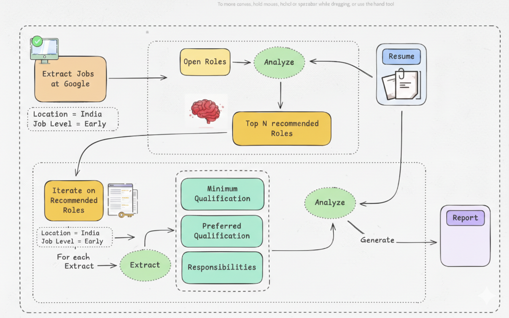

# 🤖 AI Job Search Agent

An intelligent job search assistant that automatically extracts, analyzes, and recommends suitable job roles based on a user's resume and preferences.

---

## 📌 Overview

This project helps users find relevant job opportunities by:

- Scraping job listings
- Analyzing job requirements
- Matching them with the user's resume
- Generating a detailed report

It is designed mainly for **early-career professionals** looking for jobs in **India**.

---

## 🏗️ System Architecture

Below is the workflow of the AI Job Search Agent:

---

## 🔄 Workflow

1. Extract job listings from Google
2. Filter jobs by:
   - Location: India
   - Job Level: Early
3. Open and analyze job roles
4. Match jobs with resume
5. Recommend Top N suitable roles
6. Extract:
   - Minimum qualifications
   - Preferred qualifications
   - Responsibilities
7. Analyze extracted data
8. Generate final report

---

## ⚙️ Features

- 📄 Resume-based job matching  
- 🔍 Automated job extraction  
- 🧠 AI-powered role analysis  
- 📊 Smart recommendations  
- 📝 Report generation  

---

## 🛠️ Technologies Used

- Python
- LangChain
- HuggingFace API
- Groq API
- Web Scraping
- LLM Models

---

